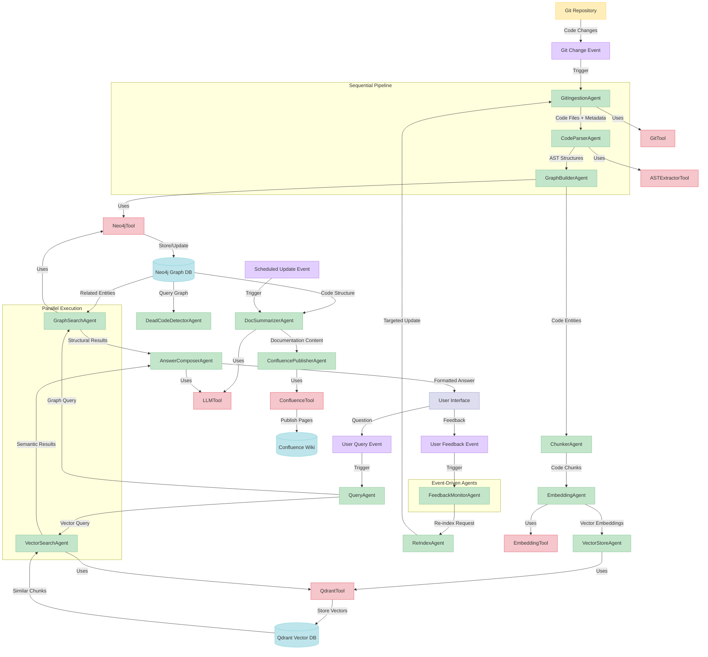

# Code Indexer: Agent Interactions Visual Representation

## Agent Interaction Patterns

The diagram above visualizes the complex interactions between agents in the Code Indexer system. Several key interaction patterns are evident:

### 1. Sequential Chain

The core indexing pipeline follows a sequential chain pattern:
- GitIngestionAgent → CodeParserAgent → GraphBuilderAgent

This ensures each step builds upon the completed work of the previous step, with each agent responsible for a specific transformation.

### 2. Hub-and-Spoke

The Neo4j graph database serves as a central hub with multiple agents connecting to it:
- GraphBuilderAgent → Neo4jDB ← DeadCodeDetectorAgent
- Neo4jDB ← DocSummarizerAgent
- Neo4jDB ← GraphSearchAgent

This pattern allows multiple agents to operate on the same underlying data model.

### 3. Parallel Fan-Out/Fan-In

The search process demonstrates parallel execution with result gathering:
- QueryAgent → VectorSearchAgent + GraphSearchAgent → AnswerComposerAgent

This improves performance by executing independent search strategies concurrently.

### 4. Event-Trigger

Multiple events trigger specific agent behaviors:
- Git Change Event → GitIngestionAgent
- User Query Event → QueryAgent
- User Feedback Event → FeedbackMonitorAgent
- Scheduled Update Event → DocSummarizerAgent

This enables responsive system behavior based on external triggers.

### 5. Tool Sharing

Several agents leverage the same underlying tools:
- ASTExtractorTool used by CodeParserAgent
- Neo4jTool used by GraphBuilderAgent and GraphSearchAgent
- QdrantTool used by VectorStoreAgent and VectorSearchAgent
- LLMTool used by DocSummarizerAgent and AnswerComposerAgent

This promotes tool reusability and consistency.

## Interaction Types

The diagram shows four primary types of interactions:

1. **Data Flow** (represented by solid lines)
   - Transfer of content and structured information between agents

2. **Tool Usage** (represented by dashed lines)
   - Agents leveraging specialized tools to perform specific functions

3. **Event Triggering** (represented by lightning-bolt lines)
   - External events initiating agent workflows

4. **Storage Operations** (represented by database cylinder connections)
   - Persistence and retrieval of information from databases

## Critical Paths

The system has several critical paths that are essential for functionality:

1. **Indexing Path**: Git → AST → Graph
   - Foundation for all other functionality
   - Must complete successfully for system to be useful

2. **Search Path**: Query → Vector/Graph Search → Answer
   - Primary user-facing functionality
   - Real-time performance requirements

3. **Feedback Path**: User Feedback → Re-indexing
   - Essential for system improvement
   - Ensures knowledge accuracy over time

## Interaction Lifecycle

Each agent interaction follows a standard lifecycle:

1. **Initiation**: Agent receives message or event
2. **Tool Selection**: Agent determines which tools to use
3. **Execution**: Agent performs its core function
4. **Result Production**: Agent generates output for next agent
5. **State Update**: System state is updated based on agent actions

## Resilience Patterns

The agent interaction design incorporates several resilience patterns:

1. **Independent State Storage**: Data persisted in Neo4j and Qdrant
2. **Loose Coupling**: Agents communicate via messages, not direct calls
3. **Retry Capability**: Failed operations can be retried independently
4. **Idempotent Operations**: Actions can be repeated safely if needed

These patterns ensure the system can recover from failures and maintain consistency even in distributed environments.