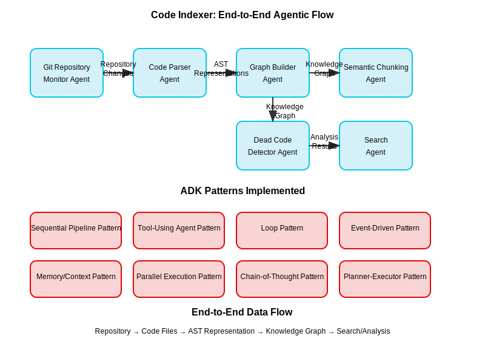

# Code Indexer: End-to-End Agentic Flow Technical Report

## 1. System Overview

The Code Indexer is a sophisticated multi-agent system built on Google's Agent Development Kit (ADK) that creates a comprehensive understanding of codebases through advanced analysis techniques. The system processes code through multiple stages, converting raw source files into a rich knowledge representation that enables natural language code search, dead code detection, and code relationship analysis.

### Core Capabilities

- **Multi-Language Code Understanding**: Process code in multiple programming languages
- **Knowledge Graph Construction**: Build a graph representation of code structures and relationships
- **Semantic Code Search**: Find relevant code using natural language queries
- **Dead Code Detection**: Identify unused functions and classes
- **Relationship Analysis**: Map dependencies between code components

### Architectural Approach

The system employs a distributed, agent-based architecture where specialized agents handle distinct responsibilities in the pipeline. Each agent is built using ADK patterns to maximize modularity, extensibility, and robustness.

## 2. End-to-End Agentic Flow



You can also view the flow as a Mermaid diagram in [images/agentic_flow_diagram.md](images/agentic_flow_diagram.md).

### 2.1 Complete Pipeline Flow

The end-to-end flow consists of these sequential processing stages:

1. **Git Repository Monitoring** → Detects code changes and triggers indexing
2. **Code Parsing** → Extracts AST (Abstract Syntax Tree) representations 
3. **Graph Building** → Creates knowledge graph of code entities and relationships
4. **Semantic Chunking** → Divides code into meaningful segments
5. **Embedding Generation** → Creates vector representations of code chunks
6. **Search & Analysis** → Enables query processing and code analysis

### 2.2 Data Flow Between Agents

```
GitAgent → CodeParserAgent → GraphBuilderAgent → ChunkingAgent → EmbeddingAgent → [SearchAgent/DeadCodeDetectorAgent]
```

#### Stage 1: Code Change Detection

**Input**: Repository URL, branch name  
**Agent**: GitIngestionAgent  
**Output**: Changed file paths, file content, metadata  
**ADK Patterns**: Event-Driven Pattern, Reactive Agent Pattern

The GitIngestionAgent monitors repositories for changes either through webhooks (event-driven) or polling (reactive). When changes are detected, it:

1. Clones or fetches the repository
2. Identifies changed files since the last indexing
3. Extracts file metadata (path, language, commit info)
4. Passes this information to the next stage

#### Stage 2: Code Parsing

**Input**: File paths, content, metadata  
**Agent**: CodeParserAgent  
**Output**: AST representations, language-specific metadata  
**ADK Patterns**: Loop Pattern, Tool-Using Agent Pattern

The CodeParserAgent processes each file to extract its syntactic structure:

1. Detects the programming language
2. Uses specialized parsing tools to generate ASTs
3. Extracts imports, classes, functions, and relationships
4. Consolidates this information into a structured representation

#### Stage 3: Graph Building

**Input**: AST representations, metadata  
**Agent**: GraphBuilderAgent  
**Output**: Neo4j graph with code entities and relationships  
**ADK Patterns**: Sequential Pipeline Pattern, Tool-Using Agent Pattern

The GraphBuilderAgent transforms syntactic information into a knowledge graph:

1. Creates nodes for files, classes, functions, and modules
2. Establishes relationships (contains, calls, imports, extends)
3. Updates existing nodes for incremental changes
4. Handles deleted files by removing corresponding nodes
5. Tracks call relationships between functions

#### Stage 4: Analysis & Search (Parallel Stage)

This stage involves multiple agents that can operate in parallel on the knowledge graph:

**DeadCodeDetectorAgent:**  
**Input**: Repository, scope, exclusion patterns  
**Output**: List of potentially unused code entities  
**ADK Patterns**: Tool-Using Agent Pattern

The DeadCodeDetectorAgent analyzes the graph to find unused code:

1. Executes graph queries to find functions with no incoming calls
2. Identifies classes whose methods are never invoked
3. Applies intelligent filtering to reduce false positives
4. Returns detailed metadata about potentially dead code

**SearchAgent:**  
**Input**: Natural language query  
**Output**: Relevant code snippets with context  
**ADK Patterns**: Planner-Executor Pattern, Parallel Execution Pattern

The SearchAgent processes user queries to find relevant code:

1. Breaks down the query using the Planner-Executor pattern
2. Executes multiple search strategies in parallel (vector, graph)
3. Combines and ranks results
4. Returns formatted code snippets with context

## 3. ADK Pattern Implementation

The Code Indexer leverages eight key ADK patterns to create a robust, extensible architecture:

### 3.1 Sequential Pipeline Pattern

**Implementation**: The core indexing flow follows a sequential pipeline where each agent processes the output of the previous agent.

**Code Example from GraphBuilderAgent:**
```python
def run(self, input_data: Dict[str, Any]) -> HandlerResponse:
    """
    Build or update the code knowledge graph.
    
    Args:
        input_data: Dictionary containing code ASTs and metadata (from CodeParserAgent)
        
    Returns:
        HandlerResponse with graph update results (for next stage)
    """
    # Extract input data from previous agent
    asts = input_data.get("asts", [])
    repository = input_data.get("repository", "")
    # [...]
    
    # Process data and prepare output for next agent
    result = {
        "files_processed": len(asts),
        "files_deleted": deleted_count,
        # [...]
    }
    
    return HandlerResponse.success(result)
```

**Benefits Realized**:
- Clear data flow boundaries between processing stages
- Predictable execution sequence
- Isolated failure domains
- Standardized input/output formats
- Incremental processing capability

### 3.2 Tool-Using Agent Pattern

**Implementation**: Agents use specialized tools to perform specific operations, particularly for database interactions.

**Code Example from DeadCodeDetectorAgent:**
```python
def init(self, context: AgentContext) -> None:
    """Initialize the agent with the given context."""
    self.context = context
    
    # Get Neo4j tool
    tool_response = context.get_tool("neo4j_tool")
    if tool_response.status.is_success():
        self.neo4j_tool = tool_response.tool
        self.logger.info("Successfully acquired Neo4j tool")
    else:
        self.logger.error("Failed to acquire Neo4j tool: %s", 
                         tool_response.status.message)

def _find_unused_functions(self, repository: str, exclude_patterns: List[str], 
                         max_results: int) -> List[Dict[str, Any]]:
    # Use the tool to execute a complex query
    tool_response = self.neo4j_tool.execute_query({
        "query": query
    })
```

**Benefits Realized**:
- Separation of concerns between agent logic and specialized functionality
- Reusable tools across multiple agents
- Consistent error handling
- Independent testing of tools and agents
- Dynamic tool discovery and instantiation

### 3.3 Loop Pattern

**Implementation**: The CodeParserAgent uses the loop pattern to process multiple files, handling each through a structured iteration.

**Example Pseudo-implementation:**
```python
def initialize(self, files: List[str]):
    self.state["files"] = files
    self.state["results"] = []
    return len(files)  # Number of iterations

def process_item(self, index: int):
    file_path = self.state["files"][index]
    language = self._detect_language(file_path)
    
    # Process file and add result to state
    # [...]
    
def finalize(self):
    return {
        "files": self.state["results"],
        "failed_count": len([r for r in self.state["results"] if r["status"] == "error"]),
        # [...]
    }
```

**Benefits Realized**:
- Structured handling of collections
- Progress tracking through iteration
- Error isolation to individual items
- Ability to process in batches
- Clean state management

### 3.4 Event-Driven Pattern

**Implementation**: The GitIngestionAgent uses the event-driven pattern to respond to repository changes without constant polling.

**Example Implementation (Conceptual):**
```python
class FeedbackMonitorAgent(EventAgent):
    """Listens for and processes feedback events."""
    
    def handle_event(self, event):
        # Repository update events
        if event.type == "repo_update":
            # Trigger indexing pipeline
            self.invoke_agent("IndexPipelineAgent", 
                            repo_url=event.payload.get("repo_url"))
```

**Benefits Realized**:
- Reactive system that responds to changes efficiently
- Reduced resource usage (no polling)
- Loose coupling between event producers and consumers
- Extensibility through new event types

### 3.5 Memory/Context Pattern

**Implementation**: The GraphBuilderAgent maintains graph statistics across invocations to track the growth and structure of the knowledge graph.

**Code Example:**
```python
def __init__(self, config: Dict[str, Any]):
    # [...]
    
    # State maintained across invocations
    self.graph_stats = {
        "files": 0,
        "classes": 0,
        "functions": 0,
        "relationships": 0
    }

def run(self, input_data: Dict[str, Any]) -> HandlerResponse:
    # [...]
    
    # Update graph stats (persistent context)
    self.graph_stats["files"] += len(file_nodes)
    self.graph_stats["classes"] += len(class_nodes)
    self.graph_stats["functions"] += len(function_nodes)
    self.graph_stats["relationships"] += relationship_count
    
    # Include in response
    result = {
        # [...]
        "graph_stats": self.graph_stats,
    }
```

**Benefits Realized**:
- State persistence across operations
- Performance optimization through incremental updates
- Historical tracking
- Context-aware processing

### 3.6 Parallel Execution Pattern

**Implementation**: The SearchAgent (conceptual) executes multiple search strategies concurrently to improve response time.

**Example Implementation (Conceptual):**
```python
def search(self, query: str):
    # Launch vector search asynchronously
    vector_future = self.invoke_agent_async("VectorSearchAgent", 
                                         query=query)
    
    # Launch graph search in parallel
    graph_future = self.invoke_agent_async("GraphSearchAgent", 
                                        query=query)
    
    # Gather and combine results
    results = {
        "vector": vector_future.get(),
        "graph": graph_future.get()
    }
    
    return self._combine_results(results)
```

**Benefits Realized**:
- Reduced latency for operations that can run in parallel
- Better resource utilization
- Improved user experience for interactive queries
- Scalable search mechanism

### 3.7 Chain-of-Thought Pattern

**Implementation**: The DocSummarizerAgent (conceptual) uses chain-of-thought reasoning to generate documentation from code.

**Example Implementation (Conceptual):**
```python
def summarize_module(self, module_data: dict):
    # First, analyze the module structure
    structure_analysis = self.think(
        f"Analyze the structure of module {module_data['name']}."
    )
    
    # Then, identify the key concepts
    key_concepts = self.think(
        f"Based on this structure: {structure_analysis}\n"
        f"What are the most important concepts?"
    )
    
    # Finally, generate documentation
    documentation = self.generate(
        f"Write documentation for module {module_data['name']} "
        f"covering these concepts: {key_concepts}"
    )
    
    return documentation
```

**Benefits Realized**:
- Improved accuracy in complex reasoning tasks
- Explainable AI with visible reasoning steps
- Refinable reasoning process
- Debugging capabilities

### 3.8 Planner-Executor Pattern

**Implementation**: The SearchAgent uses the planner-executor pattern to decompose complex queries into executable steps.

**Example Implementation (Conceptual):**
```python
def process_query(self, query: str):
    # Planning phase
    plan = self.plan(query)
    
    # Execution phase
    result = self.execute_plan(plan)
    
    return result

def plan(self, query: str):
    # Create multi-step plan
    planning_prompt = f"""
    Develop a plan to answer: "{query}"
    What tools would be most effective?
    """
    
    return self.llm_tool.generate_json(planning_prompt)

def execute_plan(self, plan):
    results = []
    for step in plan:
        tool_name = step["tool"]
        parameters = step["parameters"]
        
        # Execute step
        step_result = self.use_tool(tool_name, **parameters)
        results.append(step_result)
    
    return self.compose_answer(results)
```

**Benefits Realized**:
- Complex query decomposition
- Optimized execution strategy
- Reusable plans for similar queries
- Transparent reasoning

## 4. Pattern Integration Points

The system integrates these patterns through several key mechanisms:

### 4.1 Tool Registration and Discovery

Tools like Neo4jTool are registered with the ADK framework and discovered by agents at runtime:

```python
# Registration (in app initialization)
adk_context.register_tool("neo4j_tool", Neo4jTool())

# Discovery (in agent init)
tool_response = context.get_tool("neo4j_tool")
if tool_response.status.is_success():
    self.neo4j_tool = tool_response.tool
```

### 4.2 Standardized Response Format

All agents use HandlerResponse for consistent error handling and result formatting:

```python
# Success response
return HandlerResponse.success({
    "files_processed": 10,
    "nodes_created": 50
})

# Error response
return HandlerResponse.error("Neo4j tool not available")
```

### 4.3 Data Transformation Between Stages

Each agent transforms data from the previous stage's format to the next stage's expected format:

```python
# AST to Graph nodes transformation
def _process_ast(self, ast_data: Dict[str, Any], file_id: str, file_path: str,
              language: str, repository: str) -> Dict[str, Any]:
    # Transform AST into graph nodes and relationships
```

## 5. Advanced Pattern Applications

The Code Indexer demonstrates sophisticated applications of ADK patterns:

### 5.1 Pattern Composition

Multiple patterns are combined within single agents to create sophisticated behaviors:

- **GraphBuilderAgent**: Combines Tool-Using, Sequential Pipeline, and Memory patterns
- **DeadCodeDetectorAgent**: Combines Tool-Using and Chain-of-Thought patterns

### 5.2 Error Resilience Through Patterns

The system uses patterns to create error resilience:

```python
def _process_ast(self, ast_data: Dict[str, Any], file_id: str, file_path: str,
              language: str, repository: str) -> Dict[str, Any]:
    try:
        # Process AST into graph
        # [...]
    except Exception as e:
        self.logger.error(f"Error building graph for {file_path}: {e}")
        # Continue processing other files
```

### 5.3 Incremental Processing

The system supports incremental updates through Memory and Event-Driven patterns:

```python
# Process deleted files
if deleted_files:
    deleted_count = self._process_deleted_files(deleted_files)

# Process changed files
for ast_data in asts:
    # [...]
```

## 6. Performance Considerations

The architecture optimizes performance through strategic pattern application:

1. **Parallel Processing** for independent operations
2. **Incremental Updates** to avoid reprocessing unchanged files
3. **Batched Operations** for database efficiency
4. **Reactive Processing** to minimize unnecessary work

## 7. Future Pattern Applications

The architecture could be extended with:

1. **Feedback Loop Pattern**: Incorporate user feedback to improve search results
2. **Multi-Agent Collaboration Pattern**: Enable agents to negotiate and collaborate
3. **Learning Pattern**: Allow agents to improve based on historical interactions

## 8. Conclusion

The Code Indexer demonstrates sophisticated application of ADK patterns to create a robust, extensible code understanding system. The patterns work together to support:

- Modular component architecture
- Clear separation of concerns
- Robust error handling
- Efficient resource utilization
- Incremental processing
- Parallel execution

This architecture enables the system to scale to large codebases, support multiple programming languages, and provide fast, accurate code search and analysis capabilities.