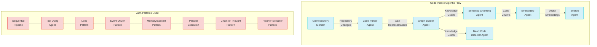

```mermaid
graph TD
    subgraph "Code Indexer Agentic Flow"
    A[Git Repository<br>Monitor] -->|Repository<br>Changes| B[Code Parser<br>Agent]
    B -->|AST<br>Representations| C[Graph Builder<br>Agent]
    C -->|Knowledge<br>Graph| D[Semantic Chunking<br>Agent]
    D -->|Code<br>Chunks| E[Embedding<br>Agent]
    E -->|Vector<br>Embeddings| F[Search<br>Agent]
    
    C -->|Knowledge<br>Graph| G[Dead Code<br>Detector Agent]
    
    end
    
    subgraph "ADK Patterns Used"
    P1[Sequential<br>Pipeline] --- P2[Tool-Using<br>Agent]
    P2 --- P3[Loop<br>Pattern]
    P3 --- P4[Event-Driven<br>Pattern]
    P4 --- P5[Memory/Context<br>Pattern]
    P5 --- P6[Parallel<br>Execution]
    P6 --- P7[Chain-of-Thought<br>Pattern]
    P7 --- P8[Planner-Executor<br>Pattern]
    end
    
    style A fill:#d4f1f9,stroke:#05c8e8
    style B fill:#d4f1f9,stroke:#05c8e8
    style C fill:#d4f1f9,stroke:#05c8e8
    style D fill:#d4f1f9,stroke:#05c8e8
    style E fill:#d4f1f9,stroke:#05c8e8
    style F fill:#d4f1f9,stroke:#05c8e8
    style G fill:#d4f1f9,stroke:#05c8e8
    
    style P1 fill:#f9d4d4,stroke:#e80505
    style P2 fill:#f9d4d4,stroke:#e80505
    style P3 fill:#f9d4d4,stroke:#e80505
    style P4 fill:#f9d4d4,stroke:#e80505
    style P5 fill:#f9d4d4,stroke:#e80505
    style P6 fill:#f9d4d4,stroke:#e80505
    style P7 fill:#f9d4d4,stroke:#e80505
    style P8 fill:#f9d4d4,stroke:#e80505
```