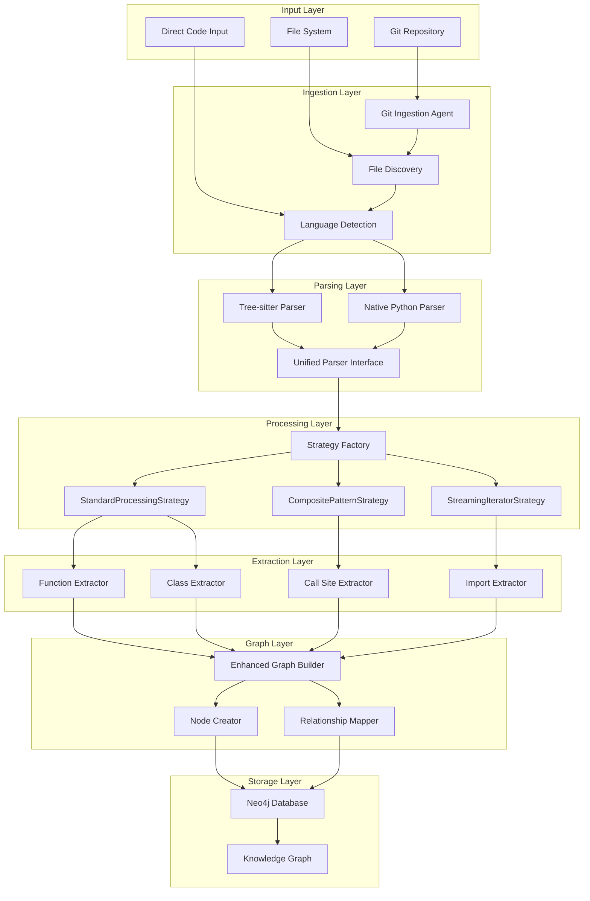
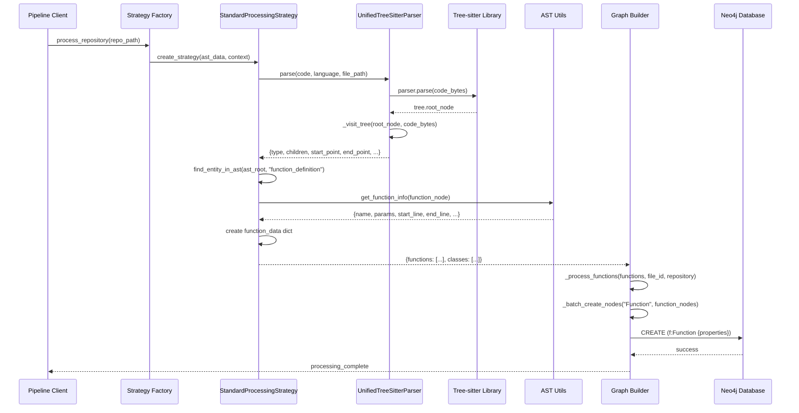
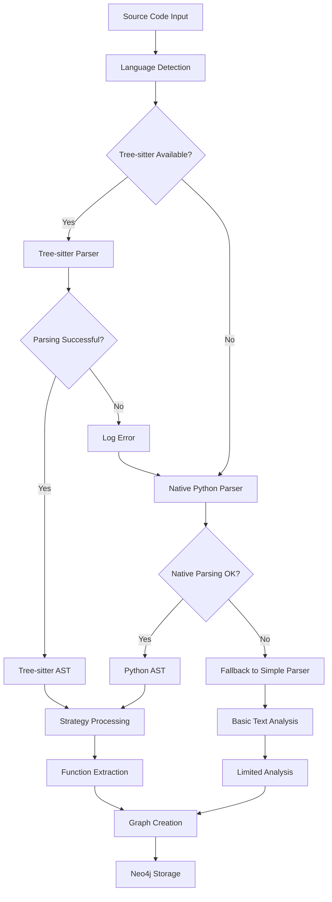
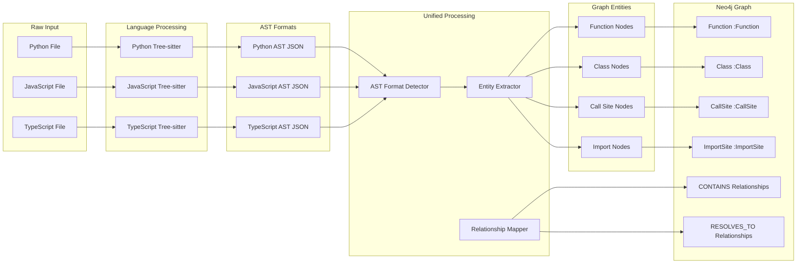
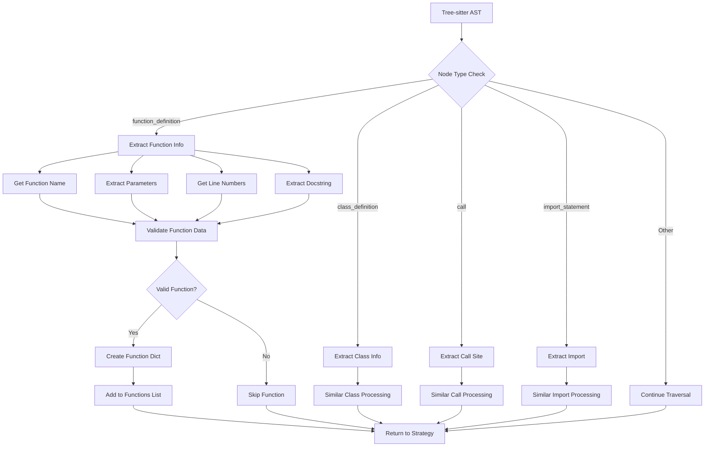
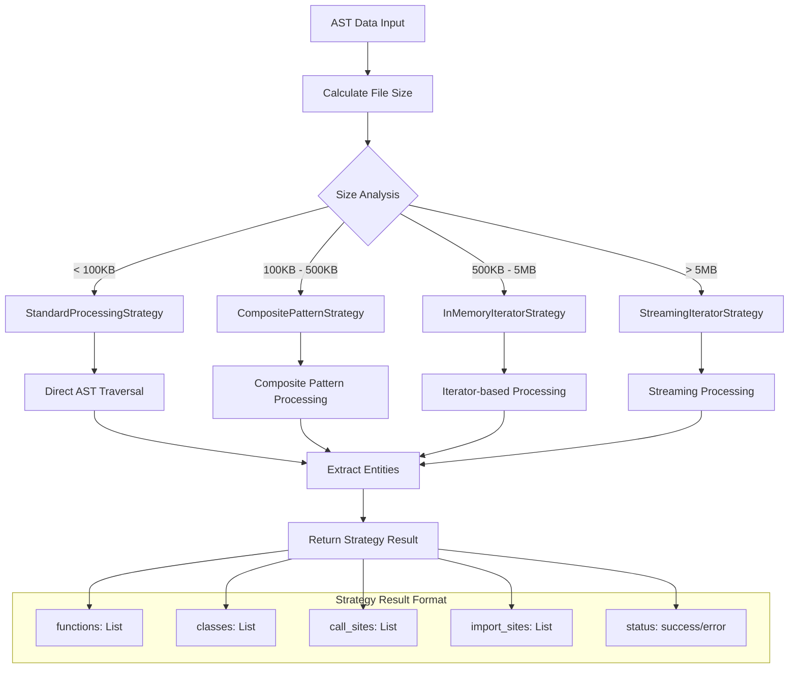
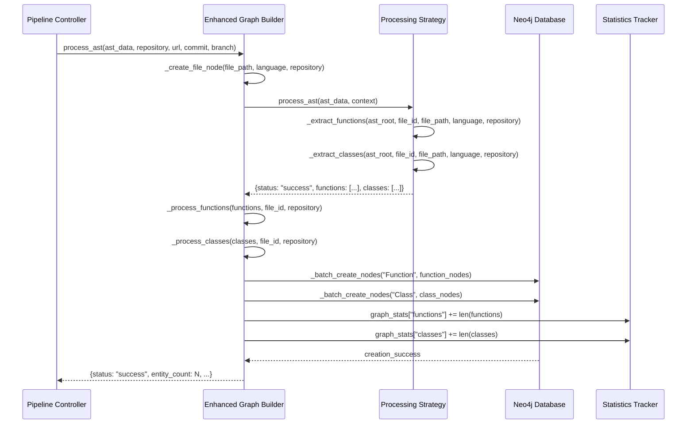
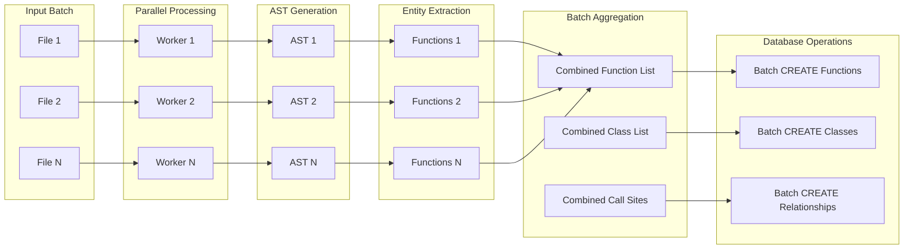
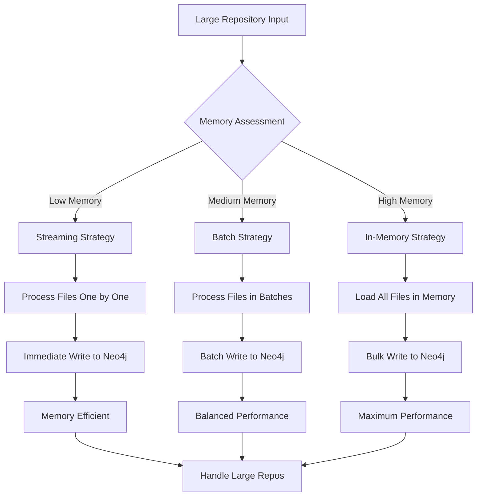
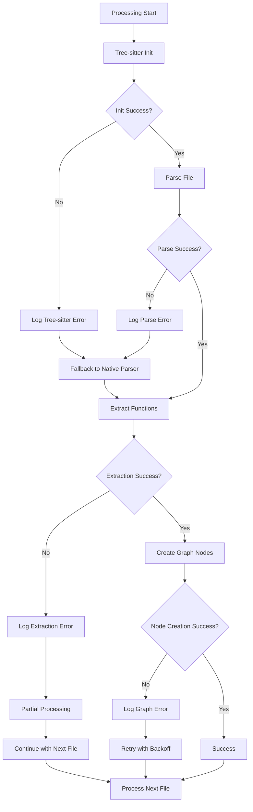

# Pipeline Architecture Diagrams

## System Architecture Overview

### High-Level Component Architecture

## Detailed Component Interactions

### Tree-sitter Integration Flow

### Error Handling and Fallback Chain

## Data Flow Architecture

### AST Processing Pipeline

### Function Extraction Detail Flow

## Strategy Pattern Architecture

### Strategy Selection Logic

### Enhanced Graph Builder Processing

## Performance Optimization Architecture

### Batch Processing Flow

### Memory Management Strategy

## Error Handling and Recovery

### Comprehensive Error Flow

This comprehensive documentation captures all the architectural improvements, data flows, and technical details of the ingestion pipeline transformation.